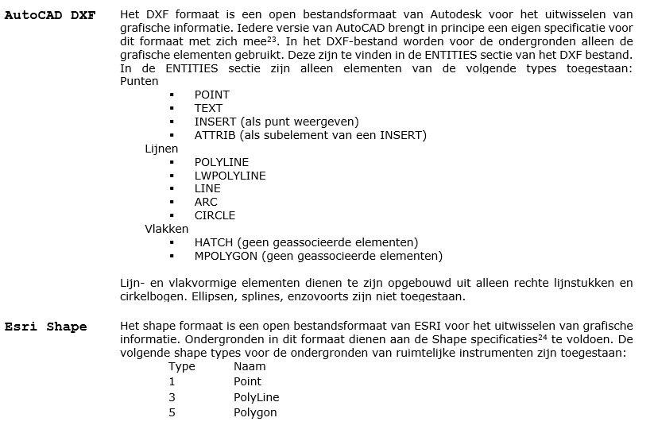

# Bijlage 3: Ondergronden
Ruimtelijke instrumenten dienen te worden gemaakt en vastgesteld op een
ondergrond in RD-coördinaatstelsel. De ondergrond waarop het plan is vastgesteld
maakt echter geen deel uit van de set van bronbestanden. De bronhouder moet
desgewenst het plan wel kunnen tonen op de ondergrond waarop het is vastgesteld
en moet tevens deze ondergrond kunnen aanleveren aan de Raad van State bij
geschillen. De landelijke voorziening Ruijmtelijkeplannen.nl toont het plan niet
op de ondergrond waarop het is vastgesteld, maar toont het plan op een algemene
en actuele ondergrond ter oriëntatie. In deze bijlage is aangegeven welke
bestandsformaten kunnen worden gebruikt voor de ondergronden.

## Mogelijke bestandsformaten ondergrond
Wanneer de bronhouder kiest voor het gebruik van een eigen ondergrond, moet deze
een duidelijke naam hebben en bij voorkeur een bestandsformaat dat door derden
ontvangen en begrepen kan worden. Ondergronden die zijn gebruikt bij het nemen
van besluiten over ruimtelijke instrumenten, kunnen in een van de volgende
formaten bij het instrument worden opgeslagen. Dit bestand is hetzelfde bestand
waaraan wordt gerefereerd bij het attribuut *ondergrondInfo* bij het plangebied
van het betreffende ruimtelijke instrument. Het doel hiervan is de
uitwisselbaarheid van deze ondergronden te verbeteren. De Raad van State
schrijft één van de onderstaande bestandsformaten voor:

-   Vectorformaten:  
	-   [AutoCAD© DXF](https://en.wikipedia.org/wiki/AutoCAD_DXF)
	-   [ESRI© shape (incl. verbeelding) in 2D](http://www.esri.com/library/whitepapers/pdfs/shapefile.pdf)
	-   GML
-   Rasterformaten
	-   JPEG 2000

Waarbij geldt:  
-   Voor de ondergronden is alleen de geometrie bepalend. Attributen en layer
    informatie zijn niet in de ondergrond behorende bij het ruimtelijk
    instrument opgenomen;
-   In het geval de ondergrond tijdens de planprocedure dient te worden
    aangepast (er moet bijvoorbeeld een actuelere ondergrond worden gebruikt),
    dan wordt dit een nieuwe versie van de ondergrond dat hoort bij die status
    van het instrument. Het is dan ook mogelijk dat bij het instrument meerdere
    (versies van) ondergronden zijn gearchiveerd;
-   Alle coördinaten van de aangeboden elementen (en geo-referenties voor
    rasterbestanden) dienen hetzelfde coördinaatsysteem te gebruiken als het
    ruimtelijk instrument waartoe het behoort. Dit is conform IMRO het
    Rijksdriehoeksstelsel, ofwel EPSG:2899229.

## Toelichting

