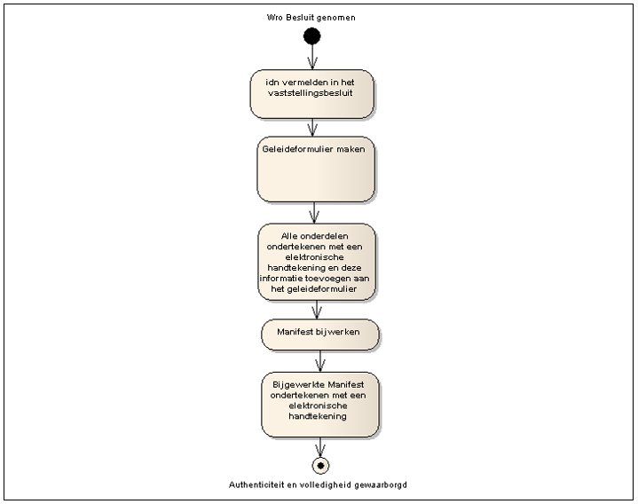

# Authenticiteitskenmerken
**De op internet beschikbaar gestelde bronbestanden inclusief manifest en
geleideformulier moeten voorzien zijn van een waarmerk waarmee de integriteit,
authenticiteit en volledigheid van de bestanden worden gewaarborgd. In dit
hoofdstuk worden de normen hiervoor toegelicht.**

## Waarmerken
Er zijn drie betrouwbaarheidsaspecten van belang bij het uitwisselen van
ruimtelijk instrumenten: integriteit, authenticiteit en volledigheid. Met het
waarmerken van alle onderdelen (NB alle bronbestanden die samen het instrument
vormen), ontstaat een aantal waarborgen:  
-  dat het instrument daadwerkelijk van de juiste bronhouder afkomstig is;
-  dat de inhoud van het instrument na waarmerken niet meer gewijzigd is;
-  dat het instrument volledig is.  
  
Met het waarmerken van het Manifest ontstaat eveneens een aantal waarborgen:  
-  dat het Manifest daadwerkelijk van de juiste bronhouder afkomstig is;
-  dat de inhoud van het Manifest na waarmerken niet meer gewijzigd is;
-  dat het Manifest volledig en actueel is.  
  
Ruimtelijke instrumenten worden gewaarmerkt met een elektronische handtekening,
waarmee de authenticiteit is gewaarborgd en de instrumenten tevens beschermd
zijn tegen wijzigen. Voor een elektronische handtekening is een certificaat van
PKI-Overheid vereist. Het proces van waarmerken is schematisch weergegeven in
Figuur 4.
  
  
**Figuur 4 Authenticatieproces**

## Authenticiteitskenmerken van een individueel instrument

Bronhouders zijn via interne maatregelen zelf verantwoordelijk dat de
instrumenten alleen kunnen worden gewaarmerkt door daarvoor geautoriseerde
personen en dat steeds de juiste instrumenten beschikbaar gesteld worden.

Afnemers van de ruimtelijk instrumenten moeten de authenticiteit, integriteit en
volledigheid van het instrument kunnen vaststellen. Dat betekent dat behalve van
de onderdelen afzonderlijk de afnemer ook in de raadpleegomgeving van het
instrument moet kunnen controleren wat de status is van het waarmerk van ieder
instrument.

## Authenticiteitskenmerken voor de totale instrumentenvoorraad

Vanwege operationele veiligheidseisen is er binnen de landelijke voorziening Ruimtelijkeplannen.nl
een aantal aanvullende beperkingen van toepassing met betrekking tot het
waarmerk binnen Manifest en Geleideformulieren, die vanwege het dynamische
karakter niet in de STRI2012 zijn opgenomen. Deze beperkingen zijn als volgt: 
   
-   DOCTYPE declaraties zijn niet toegestaan;
-   \<?xml-stylesheet /\> processing instructies zijn niet toegestaan;
-   Het gebruik van XSLT is niet- toegestaan;
-   XPointers die verwijzen naar externe bestanden zijn niet toegestaan;
-   Een Transform element met
    Algorithm="http://www.w3.org/2000/09/xmldsig#enveloped-signature" mag
    alleen voorkomen indien de Reference URI="";
-   Binnen KeyInfo elementen zijn slechts X509Data elementen toegestaan;
-   Er is slechts één X509Data element toegestaan binnen een KeyInfo element;
-   Binnen X509Data elementen zijn slechts X509Certificate elementen toegestaan;
-   Binnen een Transforms element mag slechts één Transform element voorkomen;
-   CanonicalizationMethod Algorithm en Transform Algorithm attributen mogen
    geen commentaar verwerken, XSLT toestaan, XPointer en XPath toestaan;
-   CanonicalizationMethod, Transform, SignatureMethod en DigestMethod elementen
    mogen geen subelementen of tekst bevatten;
-   SignatureMethod en DigestMethod mogen geen MD5 Algorithm gebruiken. 
  

Verder zijn alleen de volgende algoritmes zijn toegestaan[6]:  
Transform Algorithm:  
-   http://www.w3.org/TR/2001/REC-xml-c14n-20010315
-   http://www.w3.org/2001/10/xml-exc-c14n#
-   http://www.w3.org/2000/09/xmldsig#base64
-   http://www.w3.org/2000/09/xmldsig#enveloped-signature  
  

CanonicalizationMethod Algorithm:  
-   http://www.w3.org/TR/2001/REC-xml-c14n-20010315
-   http://www.w3.org/2001/10/xml-exc-c14n#  
  

SignatureMethod Algorithm:  
-   http://www.w3.org/2000/09/xmldsig#rsa-sha1
-   [http://www.w3.org/2001/04/xmldsig-more#rsa-sha256](https://www.rfc-editor.org/rfc/rfc6931#section-2.3.2)
-   [http://www.w3.org/2001/04/xmldsig-more#rsa-sha384](https://www.rfc-editor.org/rfc/rfc6931#section-2.3.2)
-   [http://www.w3.org/2001/04/xmldsig-more#rsa-sha512](https://www.rfc-editor.org/rfc/rfc6931#section-2.3.2)
  

DigestMethod Algorithm:  
-   http://www.w3.org/2000/09/xmldsig#sha1
-   http://www.w3.org/2000/09/xmldsig#sha256
-   [http://www.w3.org/2001/04/xmldsig-more#sha384](https://www.rfc-editor.org/rfc/rfc6931#section-2.3.2)
-   http://www.w3.org/2000/09/xmldsig#sha512  
  

[6] Niet van al de genoemde algorithms zijn de oorspronkelijke web-locaties nog beschikbaar.
  
Bovenstaande aanvullende beperkingen dienen verplicht te worden toegepast om te
kunnen voldoen aan de eis in het Bro dat de landelijke voorziening Ruimtelijkeplannen.nl in staat moet
zijn om de bronbestanden op te kunnen halen.
