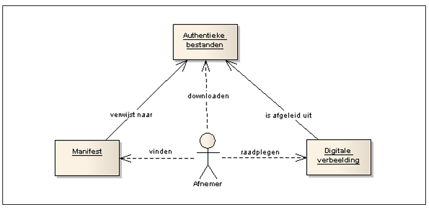

# Toegankelijkheid en raadpleegbaarheid
**In dit hoofdstuk worden aspecten van de toegankelijkheid en raadpleegbaarheid
van het ruimtelijk instrument nader toegelicht.**
## Ruimtelijke instrumenten
Als een ruimtelijk instrument eenmaal beschikbaar gesteld is, komt dit op drie
manieren tot uitdrukking:  
-   **Beschikbaarheid** : alle tot het instrument behorende bronbestanden zijn
    beschikbaar op internet en kunnen door een ieder worden gedownload;
-   **Vindbaarheid** : het ruimtelijk instrument kan worden gevonden middels het
    Manifest, waar verwijzingen naar dit instrument en de bijbehorende
    bronbestanden worden gegeven;
-   **Toegankelijkheid** : het instrument is op een toegankelijke manier
    raadpleegbaar in de digitale verbeelding, die is gegenereerd uit de tot het
    instrument behorende bestanden.  

De relaties tussen bestanden, Manifest, digitale verbeelding en hun onderlinge
functies en relaties worden weergegeven in Figuur 5. 
 
  
**Figuur 5 Relaties tussen bestanden, Manifest en verbeelding**
  
Nadat alle bestanden waaruit het ruimtelijk instrument is opgebouwd via het
internet beschikbaar zijn gemaakt, zullen deze nog niet automatisch kunnen
worden gevonden door afnemers. Er zijn twee soorten afnemers:  
-   Gebruikers / personen. Voor deze afnemers is het zoekproces niet
    gestandaardiseerd. Iedere bronhouder dient vanuit goede dienstverlening op
    de eigen website aangeven waar de eigen instrumentele voorraad te vinden is,
    en zal dus doorverwijzen naar bijvoorbeeld een RO startpagina.
-   Computersystemen. De digitale instrumenten moeten ook vindbaar worden voor
    externe systemen. Hiervoor is het Manifest bedoeld. Om het Manifest van
    iedere bronhouder eenvoudig te kunnen vinden op internet, wordt het webadres
    van ieder Manifest door de bronhouder aangemeld bij de <a href='https://www.ruimtelijkeplannen.nl/index' target='_blank'>index van Ruimtelijkeplannen.nl</a>. De Index beschikt over actuele links naar alle Manifesten van alle bronhouders. Daarmee is ieder
    ruimtelijk instrument altijd in drie stappen ontsloten voor een extern
    systeem: ten eerste wordt de Index service geraadpleegd voor het juiste
    webadres van het Manifest van de bronhouder, vervolgens wordt in het
    Manifest gezocht naar de benodigde informatie van de bronhouder, en
    tenslotte verwijst het Manifest door naar de webadressen van de individuele
    ruimtelijke instrumenten.  

In Figuur 6 is het zoeken en vinden door beide soorten afnemer schematisch
weergegeven.  
  
**Figuur 6 Zoekproces**  
  

Een belangrijk aspect van ieder ruimtelijk instrument is de volledige,
toegankelijke raadpleegbaarheid door middel van een cartografische visualisatie
die wordt gegenereerd uit de IMRO-bestanden, en die samen met de overige
inhoud beschikbaar worden gesteld. Dit wordt de digitale verbeelding van het
instrument genoemd. Het beschikbaar maken van een digitale verbeelding is nodig
omdat de IMRO-bestanden zelf voor veel afnemers niet direct bruikbaar
zullen zijn. De <a href='https://www.ruimtelijkeplannen.nl/' target='_blank'>landelijke voorziening Ruimtelijkeplannen.nl</a> is wettelijk verantwoordelijk
voor deze raadpleegbaarheid. De bronhouder kan ook zelf een verbeelding
verzorgen, bijvoorbeeld op de eigen website. Deze digitale verbeelding is een
interactieve raadpleegomgeving die afgeleid is uit de authentieke informatie. De
digitale verbeelding ontsluit de gehele inhoud van het instrument. Voor
bestemmingsplannen en inpassingsplannen wordt de digitale verbeelding gemaakt
volgens de Standaard voor Vergelijkbare Bestemmingsplannen SVBP2012.

De landelijke voorziening Ruimtelijkeplannen.nl toont de ruimtelijke instrumenten van de bronhouder
ook in onderlinge samenhang. Dit betekent op zijn minst dat de landelijke
voorziening RO de volgende vraag moet kunnen beantwoorden: *Welke ruimtelijke
instrumenten zijn er op moment van bevraging allemaal beschikbaar voor een
bepaalde (punt)locatie binnen het grondgebied van een bronhouder?*  

Naast de verplichting om bestemmingsplannen en inpassingsplannen te verbeelden
volgens de SVBP2012, kunnen in aanvulling daar op deze plannen op andere wijze
verbeeld worden ten behoeve van toelichting of verduidelijking. Deze aanvullende
verbeeldingen hebben een informatief karakter.

## Ondergrond
Op grond van artikel 1.2.4 lid 1 Bro moet bij het besluit tot vaststelling van
het ruimtelijke instrument worden aangegeven welke ondergrond is gebruikt. In
IMRO2012 is dit uitgewerkt door voor alle ruimtelijke instrumenten het opnemen
en invullen van het attribuut *ondergrondInfo* verplicht te stellen. Hoewel niet
wettelijk verplicht, is deze lijn ook gevolgd in IMWE2014. De ondergrond maakt
echter geen deel uit van de set van bronbestanden die het ruimtelijke instrument
vormen. Om die reden bevat de STRI2012 geen voorschrift over de toegelaten
bestandsformaten voor de ondergrond. Daardoor kan een bronhouder ieder
willekeurig bestandsformaat voor de ondergrond gebruiken. Dit maakt het
uitwisselen en weer gebruiken van ondergronden lastig: niet iedere applicatie
kan alle bestandsformaten inlezen. Uitwisselbaarheid van de ondergrond is
hierdoor niet gewaarborgd.  
Om die reden moet met ingang van IMRO2012 worden gekozen: de bronhouder kiest
uit een lijst van ondergronden uit basisregistraties of kiest een eigen
ondergrond. Bij het attribuut *ondergrondInfo* wordt ingevuld welke ondergrond
de bronhouder heeft gebruikt.  
Op grond van de Wet basisregistratie grootschalige topografie (BGT) is het per 1
juli 2017 voor bestuursorganen verplicht om gebruik te maken van de
Basisregistratie Grootschalige Topografie (BGT). Een bestuursorgaan kan daar
indien nodig gemotiveerd van afwijken.  
Wanneer de bronhouder kiest voor het gebruik van een eigen ondergrond, moet deze
een duidelijke naam hebben en bij voorkeur een bestandsformaat dat door derden
ontvangen en begrepen kan worden. Een lijst van bestandsformaten is opgenomen in
[Bijlage 3](#B03).  

Conform IMRO2012 is het bij de ruimtelijke instrumenten alleen mogelijk
ondergronden te gebruiken van de volgende basisregistratie(s):  
-   basisregistratie grootschalige topografie (BGT), verplicht gebruik per 1
    juli 2017.
-   basisregistratie topografie (BRT)
-   basisregistratie kadaster (BRK)
